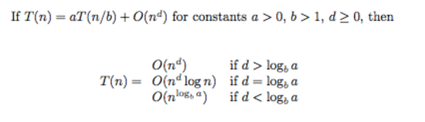

#Divide and Conqure
A divide and conquer algorithm works by recursively breaking down a problem into two or more sub-problems of the same (or related) type (**divide**), until these become simple enough to be solved directly (**conquer**)

##Master Theorem

##Codes

||Runtime|Code|
|---|---|---|
|CountInversion| T(n) = 2 T(n/2) + O(n) = O(nlogn)|[code](https://github.com/jingt06/Algorithms/blob/master/DivideAndConquer/count_inversion.cpp)|
|Merge Sort| T(n) = 2 T(n/2) + O(n) = O(nlogn)|[code](https://github.com/jingt06/Algorithms/blob/master/DivideAndConquer/merge_sort.cc)|
|Quick Select(medians of medians)| T(n) = 2 T(7n/10) + O(n/5) = O(n)|[code](https://github.com/jingt06/Algorithms/blob/master/DivideAndConquer/medians_of_five_quick_select.cc)|
|Maximun Subarray|T(n) = 2T(n/2) + O(n) = O(nlogn)|[code](https://github.com/jingt06/Algorithms/blob/master/DivideAndConquer/MaxSubarr.cpp)|